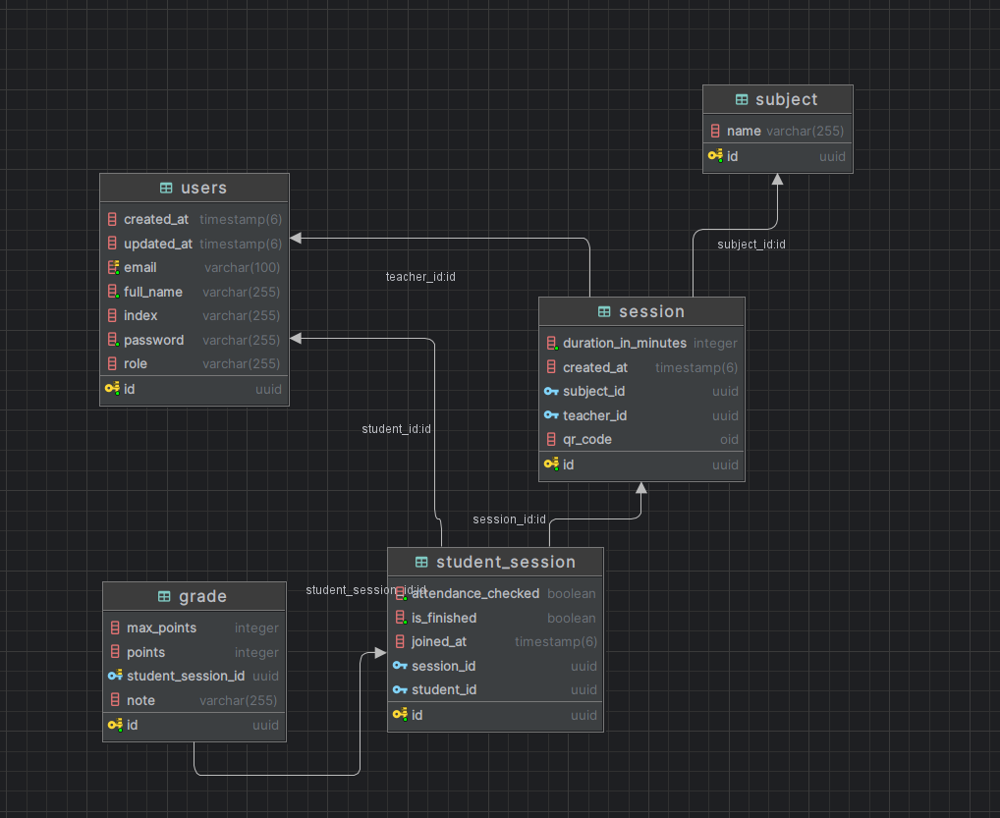

# LabsQR

Application for managing laboratory exercises attendance with QR code-based session joining and real-time attendance tracking.

## Team Members

|                      |                      |
| -------------------- | -------------------- |
| **Teodor Angeleski** | **Slave Slavkovski** |
| **Ivan Ristov**      | **Mila Mladenovska** |

## Overview

LabsQR is a full-stack application designed to manage laboratory sessions. The system enables professors to create and manage lab sessions while allowing students to join sessions via QR codes and track their attendance.

### Key Features

- **Subject Management**: Create and manage subjects
- **Session Creation**: Schedule and manage lab sessions
- **QR Codes**: Generate unique QR codes for each session
- **Student Tracking**: Monitor student attendance
- **Grade Management**: Assign and manage grades for students in the session
- **Attendance Control**: Mark student attendance

## Technology Stack

### Backend

- **Framework**: Spring Boot
- **Database**: PostgreSQL / H2
- **Security**: Spring Security with JWT authentication
- **Documentation**: Swagger/OpenAPI 3
- **QR Code Generation**: ZXing library
- **Containerization**: Docker & Docker Compose

### Frontend

- **Framework**: Flutter
- **State Management**: Provider pattern
- **HTTP Client**: Built-in Dart HTTP
- **QR Code Scanning**: Mobile camera integration

## Getting Started

### Backend Setup

#### Development with H2 Database

```bash
cd backend
./backend.sh h2
```

Access H2 console at [http://localhost:8080/h2-console](http://localhost:8080/h2-console)

- JDBC URL: `jdbc:h2:mem:timski`
- Username: `sa`
- Password: (leave empty)

#### Production with PostgreSQL

```bash
cd backend
./backend.sh
```

This starts the backend with PostgreSQL using Docker Compose.

#### API Documentation

Once the backend is running, access the Swagger API documentation at:
[http://localhost:8080/swagger-ui.html](http://localhost:8080/swagger-ui.html)

### Frontend Setup

```bash
cd frontend
flutter pub get
flutter run
```

## Development

### Project Structure

```
├── backend/                 # Spring Boot application
│   ├── src/main/java/      # Java source code
│   ├── src/main/resources/ # Application configuration
│   ├── compose.yaml        # Docker Compose configuration
│   └── Dockerfile          # Docker container configuration
└── frontend/               # Flutter application
    ├── lib/                # Dart source code
    ├── android/            # Android-specific configuration
    └── pubspec.yaml        # Flutter dependencies
```

### Database Schema

- **Users**: Store professor/student information
- **Subjects**: Subjects/courses
- **Sessions**: Lab session details with QR codes
- **StudentSessions**: A session that a student has joined
- **Grades**: Student grades and feedback for a student in a session


